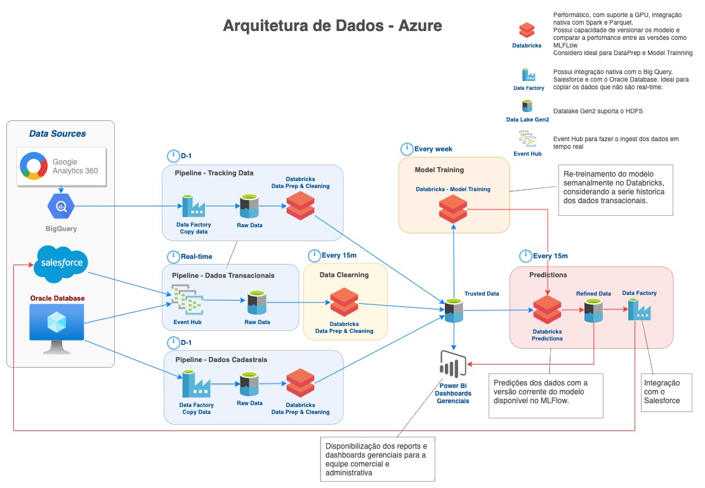
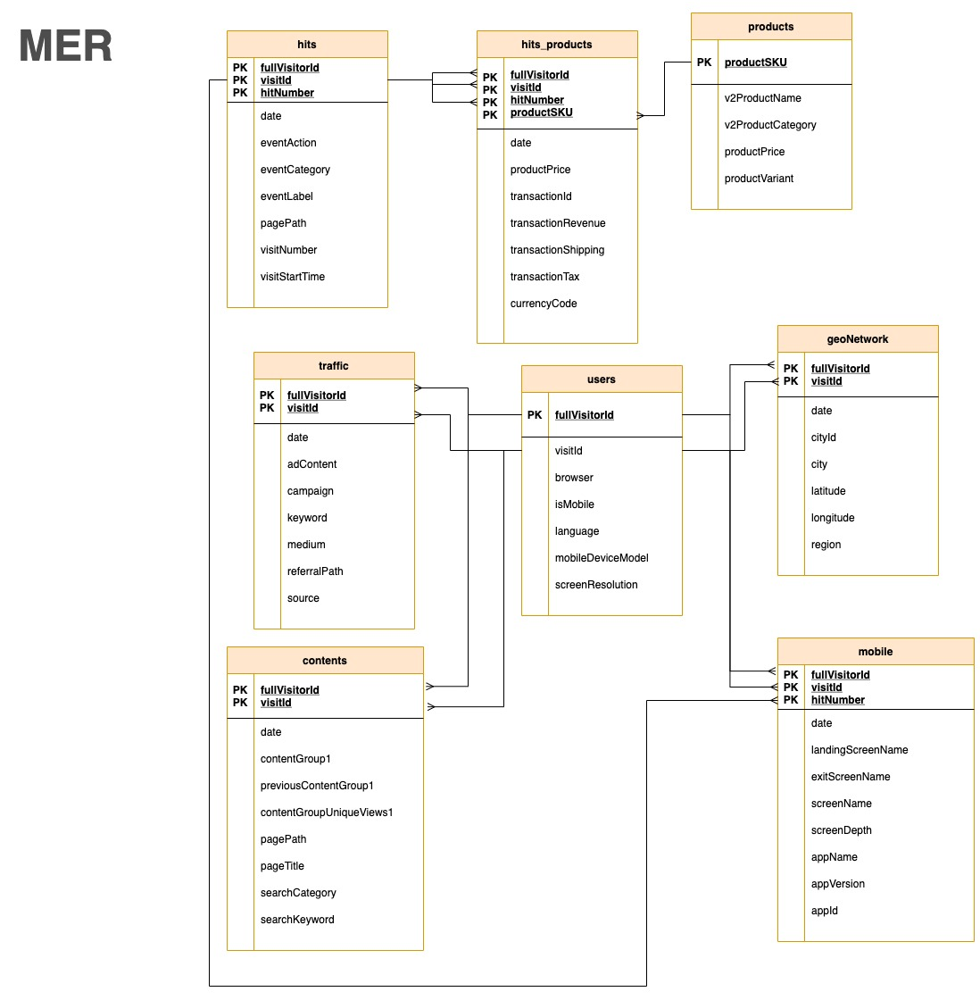

# PoC Google Analytics 360 Data with Databricks
### Data: 21/Abr/21
#### Author: Ismael R.

## Overview
This project is simple demonstration about how you can handle Google Analytics data with Spark 3.1 using Databricks in a Azure Cloud
and propose an architecture to implement a Machine Learning Operation (MLOps).

### Requirements
- [Python 3.8](https://www.python.org/downloads/release/python-380/)
- [Databricks Runtime 8.1 ML](https://docs.databricks.com/release-notes/runtime/8.1.html)
- [Spark 3.1.1](https://spark.apache.org/docs/latest/)
- [Azure Data Lake Storage Gen2](https://docs.microsoft.com/pt-br/azure/storage/blobs/data-lake-storage-introduction)

### Contents
- **[PoC.dbc](PoC.dbc)**: Databricks notebook file
- **[PoC.ipynb](PoC.ipynb)**: Jupyter notebook file
- **[PoC.html](PoC.html)**: Notebook visualization in HTML
- **data.json**: Ecommerce site demo data. [Read more](https://support.google.com/analytics/answer/7029846?hl=en&ref_topic=9359001)
- **datasets**: Folder with the exported data

## Installing on Databricks
In order to run this code you must create a Databricks instance in an Azure cloud and Azure Data Lake Storage Gen2.

### Steps
1. [Create a Azure Data Lake Storage](https://docs.microsoft.com/pt-br/azure/storage/blobs/create-data-lake-storage-account).
2. Create a Container in Data Lake.
3. Get the Access Key to your Data Lake.
4. [Create a Databricks instance and a cluster](https://docs.microsoft.com/pt-br/azure/databricks/scenarios/quickstart-create-databricks-workspace-portal?tabs=azure-portal)
5. Import the *PoC.dbc* file as a new notebook. [Read more...](https://docs.databricks.com/notebooks/notebooks-manage.html#import-a-notebook)

## Architecture

The following architecture proposes a creation of Machine Learning operation.

## MER

